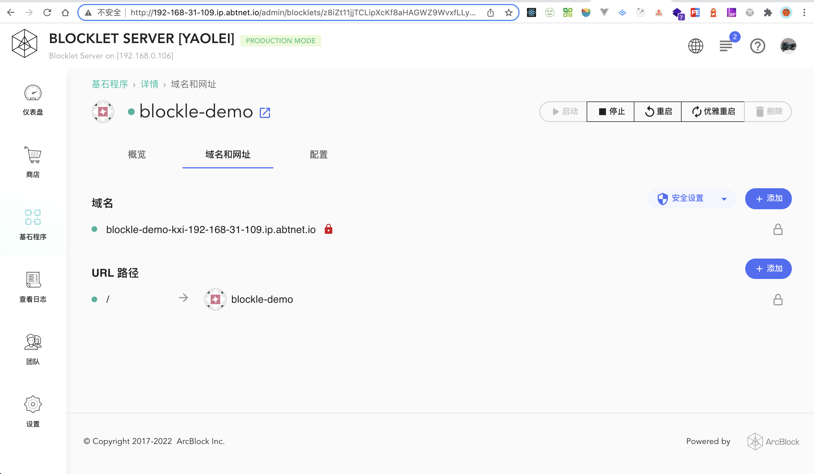

# blocklet-demo
#### 项目启动
- 本项目由 [create-blocklet](https://github.com/blocklet/create-blocklet) 创建，demo主要逻辑在 `src/pages/btc-block` 里面
- 本地启动 `yarn && npm run start`，本地开发依赖[@blocklet/cli](https://www.npmjs.com/package/@blocklet/cli)
- 本地打包部署 `npm run deploy`， 部署到 block server `blocklet deploy .blocklet/bundle --endpoint http://192.168.31.109/admin --access-key z1TXhktKoHqcTLMtdCYDStNZbmy7FrrZ3v8 --access-secret ziggfHg4VEnxQJHeQfG8NoiRKdBmTfCxQ7eHuVPZrq5mHRNaj8X8FEbG2LecYgU5YZ8ZcSxUQReWQduceqhrUy9h`
- 为方便演示demo项目 acces key secret 均明文放置
- 本项目主业务逻辑未用到 create-blocklet 生成的 server
#### 项目运行截图
|  |  |  |  |
| ----------------------------- | ----------------------------- | ----------------------------- | ------------------------------ |
#### 本地Blocklet store截图
|  |  |  |
| --------------------------- | ----------------------------- | ----------------------------- |

#### 疑问点
1. 下载 DID Wallet ，安卓app可以通过本地启动服务生成的二维码扫码进入管理页面，同样的操作ios设备却无法进入，扫码后一直显示`更新应用信息...` 
2. 同一个账户移动端设备能通过`密码`进入钱包 pc 却不可以，只能用该密码进入 Blocklet store 
3. 部署到本地 block server 应用启动后的 url 无法访问
  

